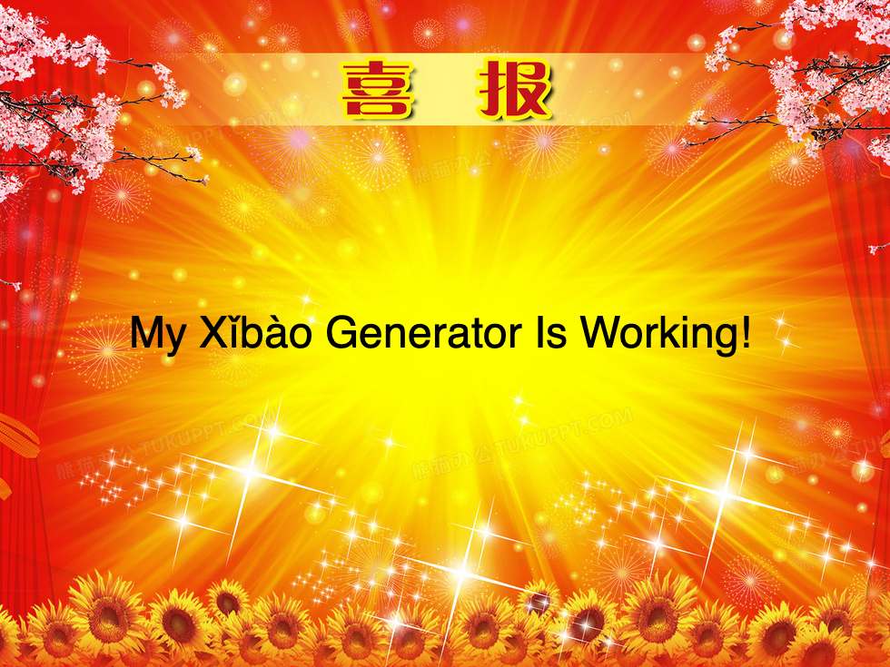

# Xǐbào Generator

Generates a picture with a title of Xǐbào (CONGRATULATIONS) and given text in the middle.

Very early stage.

Sample result:


## Build dependencies
- A C/C++ toolchain.
- SDL3 available in `pkg-config`, run `pkg-config --cflags sdl3` to confirm.
- SDL3_image available in `pkg-config`, run `pkg-config --cflags sdl3-image` to confirm.

## Non-Rust dependencies
This project depends on the following non-rust libraries.
- LibC (of course)
- C++ standard library (for Skia)
- SDL3
- SDL3_image
- Skia
- Any library that the libraries above depend on

## How to use the tool (some examples)
Assuming the tool's binary is called `xibao-gen`.

To generate a Xǐbào with given text, use
```shell
xibao-gen "Your text here"
```
or
```shell
xibao-gen --text "Your text here"
```

If the given text is in a file, then use `-i` or `--from-file` to specify the path of the file.
```shell
xibao-gen -i path/to/your/file
```
instead.

The output image will usually named `output.png` in the current directory. If you want to specify output image's path, you can use `-o` or `--to-file`.
```shell
xibao-gen -o path/to/output.png -i path/to/your/file
```
Notice that `.png` will be added automatically if you don't.

To adjust size of the image, use `--size` or for short `-s`. (Default size is 48)
```shell
xibao-gen -s 64 Hello_World
```

Combine them together, here is an example for generating a Xǐbào picture, which the content is from file `xibao_content.txt`, and outputs to `result.png`, using font size of 64:
```shell
xibao-gen -i xibao_content.txt -o result.png -s 64
```

For further help, use
```shell
xibao-gen --help
```

